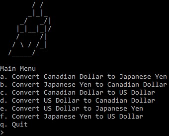

# Canjapus
## Overview
Canjapus (Canada-Japan-United States) is a console application written entirely in Lua which converts between Canadian, Japanese and United States currency. The conversion factors used are the ones in place as of **Monday, October 12, 2020**. The functions for converting between the different currency types are written using a TDD or test-driven development approach (i.e. the unit tests are written first and then the corresponding functions are written). The unit test functions are provided from the [**LuaUnit**](https://github.com/bluebird75/luaunit) unit-testing framework by Philippe Fremy.

## Getting Started
### Prerequisites
* Git https://git-scm.com/downloads
* Lua(5.4) https://www.lua.org/download.html

You can check if you have Git installed by running the following in either the command line or terminal:
```
git --version
```
You can check if you have Lua installed by running the following in the command line/terminal:
```
lua -v
```
### Installation Instructions
In the command line/terminal, set your current directory to be where you want the project to be and clone the repository using the following Git command:
```
git clone https://github.com/tonypham04/Canjapus.git
```
## Operation Instructions
The point of execution for this program is the *main.lua* file. Run the program by performing the following in the command line/terminal:
```
lua54 main.lua
```
**TIP**: The command you enter before 'main.lua' corresponds to the name of the .exe file when you install Lua. For example, in this case lua version 5.4 is installed, meaning this system has a file called *lua54.exe*. For convenience you can rename this file to simply *lua.exe* and that way, you can run the program by simply running the following in the command line/terminal instead:
```
lua main.lua
```
After running the above command you should be greeted with the program main menu as shown below:  
  
Select the option which corresponds to what you would like to convert. For example, if you want to know how much $10.00 Canadian is in Japanese Yen, select option *a* (this is not case-sensitive so there is no need to worry if caps lock is on or off). Enter the dollar amount only (i.e. do not include symbols such as *$* when prompted for amounts regardless of which conversion you would like). In the case of the example of how much Japanese yen $10.00 Canadian is worth, *10.00* or simply *10* should be entered after choosing option *a*.  
  
If you enter an invalid amount you will be prompted to try again. If however you wish to return to the main menu instead, you can do so by pressing *b* or *B* to go back. After entering a valid amount to convert you will see the result of the conversion and return to the main menu. Continuing with the $10.00 Canadian to Japanese yen example, you should see the following:  
  
To exit the program, from the main menu press *q* or *Q* as shown below:  
  

## Release History
### Monday, October 12, 2020
* Initial project release
* Unit tests for all conversions were written before the conversion functions themselves (TDD)
* Ability to perform the following conversions:
1. Convert from the Canadian dollar to the Japanese yen and vice-versa
2. Convert from the Canadian dollar to the American dollar and vice-versa
3. Convert from the American dollar to the Japanese yen and vice-versa
* Ability to try again after entering invalid input
* Ability to return to the main menu after selecting an option other than *q* or *Q*
* Introduction of the *Canjapus* logo in the main menu